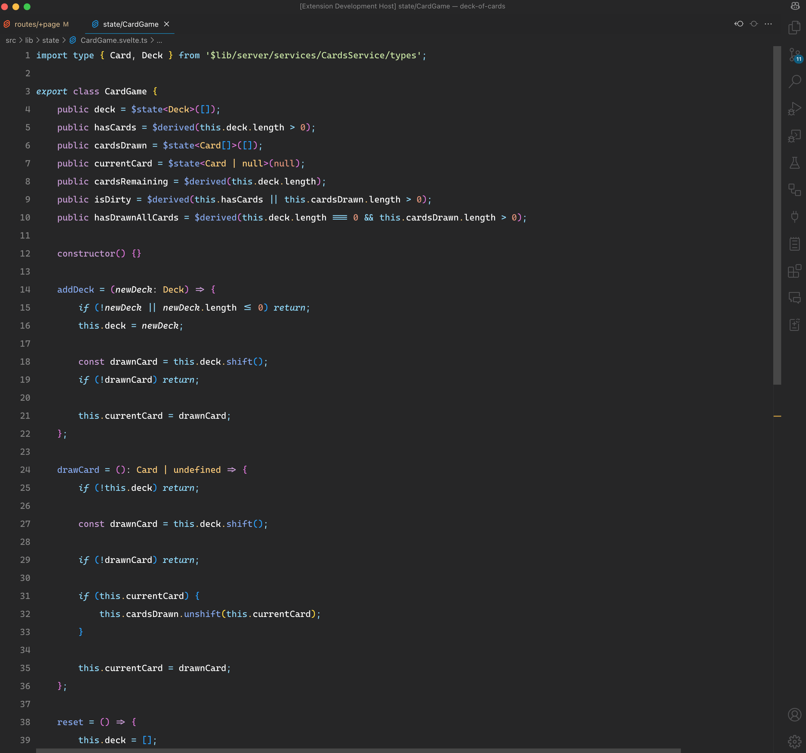

# Atlantic Midnight for [Visual Studio Code](http://code.visualstudio.com)

A dark theme for [Visual Studio Code](http://code.visualstudio.com).

## Maintainers & Contributors:

It's just me! We stare at our editors for hours so we should like the way it looks.

|  |
| :------------------------------------------------------------------------------------------------------: |
|                             [Sandrico P.](https://github.com/sandricoprovo)                              |

-   [Github](https://github.com/sandricoprovo)
-   [BlueSky](https://bsky.app/profile/sandricoprovo.com)

### License

[MIT License](https://github.com/sandricoprovo/atlantic-midnight-theme/blob/main/LICENSE.md)
